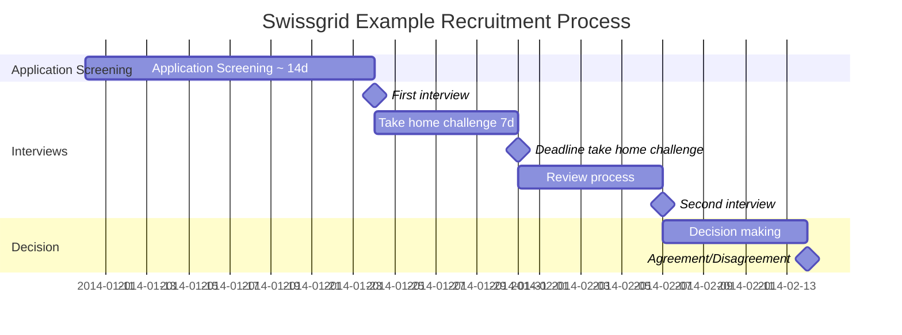

# Swissgrid Hiring Challenges for Software Engineer profiles

Our usual Interview flow for technical profiles looks like this, take timeframes with a grain of salt:

If there are any questions please open up a Github Issue.
