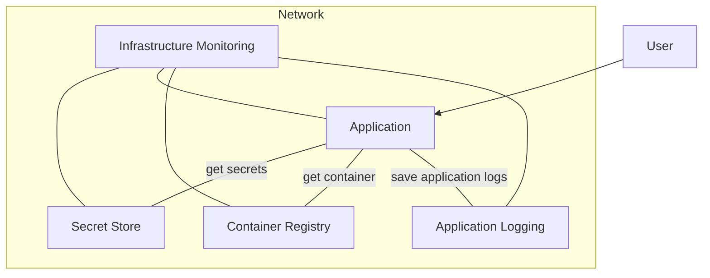

# Cloud Engineering Azure Terraform Challenge

## Intro

Swissgrid wants to deploy a webapplication on its Azure Tenant.
Currently the question is not about scalability and availability but about deploying the webapplication quickly & in a safe manner on multiple environments.
(We use a [DTAP Framework](https://en.wikipedia.org/wiki/Development,_testing,_acceptance_and_production)).
Terraform as Infrastructure as Code language and Microsoft Azure as Hyperscaler technology have been chosen.
For simplicity the application itself is only one container and there is no backend/frontend split.

The following requirements of the terraform deployment have to be fullfilled:

- Secrets have to be stored somewhere
- Containers have to be stored somewhere
- Infrastructure where the container can run on
- Infrastructure and Application itself have to be monitored
- Networking has to be setup so only certain IP Ranges are allowed(fantasy example Azure West Europe 40.74.28.0/23)
- Integration of tags(e.g. Owner, Environment, ...)
- environmentagnostic(dev, test, acceptance, prod)

**Please invest no more than 3 to 5 hours.**

If you cannot complete the task in this time frame, document where you got stuck and how you would have continued.
Give us the rubber bands and duct tape version of this challenge.
We want to see how you approach the problem, not that you write the most perfect code.

## Your challenge in a nutshell:

### Abstract solution design

### Step 1

* Which Azure Technologies are you choosing to solve which requirement?
* How would you deploy this?
* Which security considerations are you doing(Infrastructure and deployment wise)?

### Step 2

* Start writing your Terraform scripts 
* Document your decisions, your approach and your code

## Evaluation criteria

What we're looking for:

* Clean project setup
* Right infrastructure for the job
* Understanding of Applications on Azure
* Document your approach, your decisions, and your general notes

## Preparations for interview

* send us your solution atleast one businessday in advance
* prepare to present your approach & terraform code for 5-10 min (no slides!)
* be prepared to answer a few questions after your presentation
